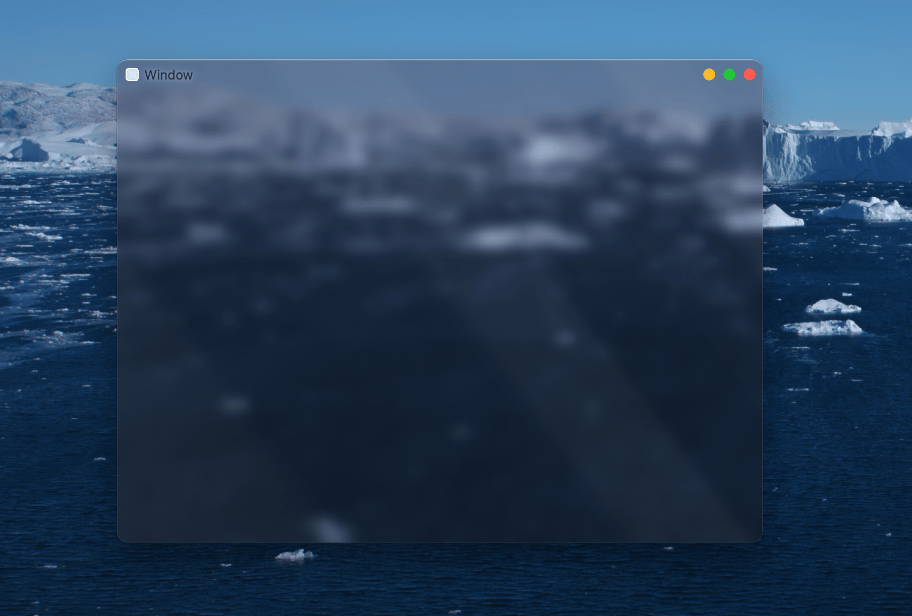

Waterweed
=========



Waterweed recreates Windows 7 Aero-style windows on macOS by sacreligiously poking into the internals of `NSWindow`.

How to Use
----------

This is a work in progress.

```swift
let window = MSWindow()
window.contentView.addSubview(NSView())
window.makeKeyAndOrderFront(nil)
```


Naming
------

[Waterweeds](https://en.wikipedia.org/wiki/Elodea) are a kind of freshwater plants that produce air in aquatic environments. The [twoleaf waterweed](https://en.wikipedia.org/wiki/Elodea_bifoliata) could be found west of the Mississippi River.

License
-------

Released under [BSD-2 License](./LICENSE.md).
